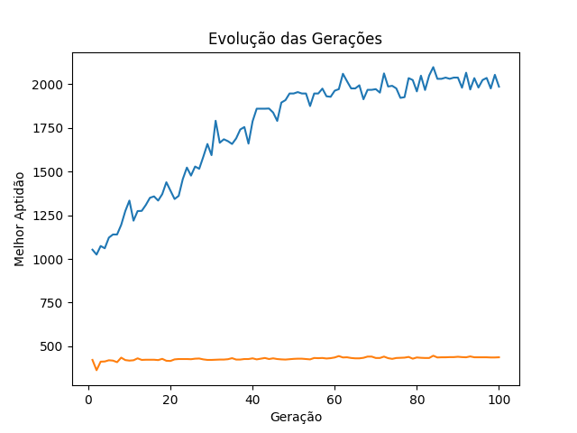

# k8sgaScheduler

## Genetic Algorithm for 5g K8s Scheduler

Este repositório armazena o protótipo de um algoritmo genético para fomentar o aprimoramento do scheduler padrão do Kubernetes. O objetivo do projeto é melhorar a orquestração das funções do núcleo levando em consideração a comunicação entre os PODs do cluster.

> **Note**: O projeto em fase de andamento porém funcional para testes iniciais

## Como utilizar:

Ao executar o Algoritmo irá solicitar as sequintes informações:

Para os Nós:
- A quantidade de Nós do cluster
- A quantidade de CPU de cada Nó do cluster
- A quantidade de Memória de cada Nó do cluster

Para os PODs:
- A quantidade de PODs a serem alocados
- A Porcentagem de relacionamentos

Clone este repositório e:

```bash
cd k8sgascheduler
python algoritmoGenetico.py
```

> **Note**: A porcentagem de relacionamentos diz respeito a probabilidade de um POD se relacionar (trocar informações) com outro POD. O algoritmo irá gerar aleatoriamente um peso para os PODs que se comunicam para simular o trafego de informações. Cada POD também terá requisitos de CPU e Memória e esses requisitos serão gerados aleatoriamente entre 100 e 200 tanto para memória quanto para CPU.

O algoritmo irá computar a quantidade de recursos no Cluster e a quantidade de recursos solicitados pelos PODs. Caso os recursos sejam insuficientes a alocação não será feita. Do contrário o algoritmo segue seu fluxo.

## Resultado do algoritmo

Serão criadas três matrizes:
- Matriz dos Nós 
    - Contem informações dos Nós do Cluster
- Matriz dos PODs
    - Contem informações dos PODs do Cluster
- Matriz de Relacionamentos
    - Contem o relacionamento entre os PODs

Exemplo de utilização:
```bash
---------------------------------------------
 Alocação de recursos em um Cluster K8s
---------------------------------------------
# Gerando os Nós da Infraestrutura #
Digite a quantidade de nós da Infraestrutura: 3
Informe a quantidade de cpu dos nós: 2000
Informe a quantidade de memória dos nós: 2048
---------------------------------------------
# Gerando os Pods da Infraestrutura #
Digite a quantidade de Pods a serem alocados: 16
Digite a porcentagem de relacionamentos (0-100): 50

Matriz dos Nos:
Nó 0: Memória=2048 CPU=2000
Nó 1: Memória=2048 CPU=2000
Nó 2: Memória=2048 CPU=2000
Quantidade total de CPU dos Nós: 6000
Quantidade total de Memória dos Nós: 6144

Matriz de Pods:
{'memoria': 183, 'cpu': 188}
{'memoria': 176, 'cpu': 117}
{'memoria': 128, 'cpu': 138}
{'memoria': 190, 'cpu': 156}
{'memoria': 101, 'cpu': 152}
{'memoria': 107, 'cpu': 122}
{'memoria': 178, 'cpu': 175}
{'memoria': 102, 'cpu': 108}
{'memoria': 115, 'cpu': 116}
{'memoria': 195, 'cpu': 106}
{'memoria': 200, 'cpu': 181}
{'memoria': 183, 'cpu': 189}
{'memoria': 191, 'cpu': 124}
{'memoria': 121, 'cpu': 142}
{'memoria': 163, 'cpu': 160}
{'memoria': 134, 'cpu': 149}
Quantidade total de CPU requerida pelos PODs: 2323
Quantidade total de Memória requerida pelos PODs: 2467


Matriz de Relacionamentos:
[0, 0, 0, 1, 5, 9, 9, 1, 0, 5, 8, 9, 0, 4, 0, 0]
[0, 0, 7, 0, 0, 0, 0, 0, 0, 1, 1, 0, 0, 0, 0, 7]
[3, 6, 0, 1, 8, 1, 0, 1, 4, 0, 6, 0, 10, 0, 0, 0]
[0, 0, 5, 0, 7, 0, 2, 0, 0, 6, 0, 0, 0, 0, 10, 3]
[4, 0, 0, 0, 0, 0, 8, 0, 10, 0, 0, 0, 8, 8, 0, 0]
[0, 0, 0, 9, 0, 0, 7, 4, 7, 0, 0, 0, 0, 0, 5, 9]
[2, 10, 0, 0, 6, 9, 0, 0, 0, 1, 3, 9, 0, 9, 0, 0]
[0, 0, 3, 3, 0, 8, 0, 0, 6, 3, 0, 0, 1, 0, 6, 9]
[2, 7, 0, 0, 5, 0, 9, 0, 0, 4, 9, 0, 0, 0, 7, 0]
[0, 4, 0, 1, 0, 0, 2, 4, 0, 0, 9, 0, 0, 0, 4, 0]
[0, 0, 2, 9, 6, 3, 9, 6, 9, 5, 0, 0, 7, 0, 7, 0]
[10, 0, 1, 0, 5, 8, 0, 0, 6, 10, 0, 0, 0, 8, 7, 0]
[0, 7, 0, 6, 0, 0, 6, 1, 0, 0, 4, 10, 0, 3, 2, 2]
[5, 1, 10, 0, 6, 1, 0, 8, 0, 9, 4, 0, 0, 0, 0, 0]
[1, 7, 3, 6, 0, 2, 0, 0, 7, 1, 0, 3, 0, 5, 0, 0]
[0, 2, 0, 9, 0, 0, 0, 0, 0, 0, 0, 10, 0, 0, 7, 0]
```
O algoritmo irá retornar o melhor indivíduo (melhor alocação) de cada uma das gerações (100). Ao final o Algoritmo retorna a melhor alocação e a melhor aptidão encontrada.

O Algoritmo também irá retornar um grafico representando a evolução das alocações até a alocação ótmia encontrada.

