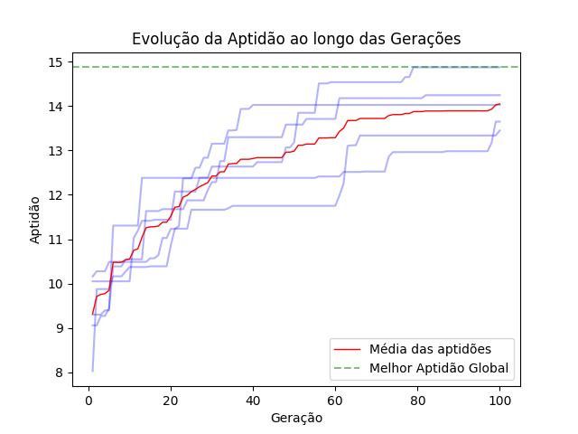

# k8sgaScheduler
**Algoritmo para alocação inteligente de recursos em cluster kubernetes**

> Artefato proposto no artigo intitulado: K8sGAScheduler: Algoritmo para alocação inteligente de recursos em cluster kubernetes apresentado no WGRS – Workshop de Gerência e Operação de Redes e Serviços - 2024.

## Introdução

O Kubernetes é uma plataforma de código aberto amplamente utilizada para gerenciar cargas de trabalho e serviços em contêineres. No entanto, a otimização da alocação de pods é uma questão complexa que requer soluções avançadas. Este projeto apresenta o K8sGAScheduler, um algoritmo inteligente desenvolvido para otimizar a alocação de recursos em clusters Kubernetes. Nossa abordagem leva em conta o consumo de recursos, a comunicação entre os pods e as restrições de capacidade dos nós.

O problema consiste em classificar diferentes alocações para determinar a solução mais eficiente. A solução ideal maximiza a utilização dos recursos em cada nó individualmente e agrupa os pods que mantêm comunicação frequente em um mesmo nó. Foi proposta uma modelagem matemática para representar o problema e, para sua resolução, utilizou-se uma abordagem baseada em um algoritmo genético implementado em Python.

É importante mencionar que este código é uma avaliação do modelo matemático proposto para o K8sGAScheduler e, nesta fase, não é executável diretamente no Kubernetes. A finalidade deste projeto é validar a formulação matemática e o algoritmo de avaliação de alocação.

## Dependências

Para executar este repositório localmente, é necessário suprir as seguintes dependências:

- Python 3.8+: Linguagem de programação principal utilizada no projeto.
- Bibliotecas Python:
  - numpy: Para operações matemáticas e manipulação de arrays.
  - matplotlib: Para visualização de dados e geração de gráficos.
- Para nossos testes, usaremos o PyCharm como IDE, mas sua utilização é opcional, pode-se executar diretamente no terminal.

## Teste experimental

Nesta sessão, será apresentado um script demo para testes básicos de funcionalidade. Para testes personalizados, consulte a seção de Documentação.

O teste experimental consiste na alocação de 25 pods, sendo 15 pods com requisitos de CPU de 50m e memória de 64Mi, e 10 pods com requisitos de CPU de 100m e memória de 128Mi. Para simular a comunicação entre os pods, a matriz de relacionamentos é preenchida com valores aleatórios entre 0 e 1 em 10% de seus espaços. Nesse exemplo, quanto mais próximo de 1 o valor, maior a comunicação entre os pods.

As configurações do algoritmo genético para o teste experimental consistem em uma população de 100 indivíduos e 100 gerações como critério de parada. A probabilidade de cruzamento é de 80% e a taxa de mutação é de 20%. O algoritmo será reexecutado 5 vezes (por padrão) e, ao final, os resultados e um gráfico de evolução serão apresentados.

- Clone este repositório e execute o arquivo k8sgascheduler_demo.py (via pycharm ou terminal)
1. Via PyCharm: abra o arquivo demo deste repositório na IDE e execute (shift+f10).
2. Via terminal: acesse o diretório do repositório e execute:

```shel
python k8sgascheduler_demo.py
```

### Retorno do Algoritmo

```shell
Melhor Aptidão Global: 14.872363281249998
Melhor Alocação Global: [2, 0, 2, 2, 2, 2, 0, 2, 2, 2, 2, 2, 2, 2, 2, 2, 2, 2, 2, 2, 0, 2, 2, 2, 2]
Média Global das Aptidões: 12.739945624999997
Mediana Global das Aptidões: 12.961888020833333
Mínimo Global das Aptidões: 8.031731770833334
Desvio Padrão Global das Aptidões: 1.4051678021004357
```



## Documentação

Para mais informações sobre o projeto e testes mais elaborados acesse a Documentação: [k8sGaScheduler](docs/documentacao.md)