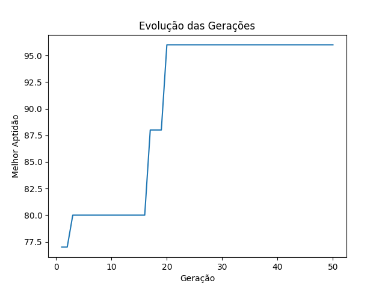

# k8sgaScheduler

## Genetic Algorithm for 5g K8s Scheduler

Este repositório armazena o protótipo de um algoritmo genético para fomentar o aprimoramento do scheduler padrão do Kubernetes. O objetivo do projeto é melhorar a orquestração das funções do núcleo levando em consideração a comunicação entre os PODs do cluster.

> **Note**: O projeto em fase de andamento porém funcional para testes iniciais

## Como utilizar:

Clone este repositório e execute:

```bash
cd k8sgascheduler
python algoritmoGenetico_flat.py
```

O Fluxo do algoritmo ocorre da seguinte maneira:

Serão criadas três matrizes:
- Matriz dos Nós 
    - Contem informações dos Nós do Cluster
    ```python
    matriz_nos=[
        {"id": 0, "cpu_no": 1000, "memoria_no": 1024},
        {"id": 1, "cpu_no": 1001, "memoria_no": 1024},
        {"id": 2, "cpu_no": 1002, "memoria_no": 1024}
    ]
    ```
- Matriz dos PODs
    - Contem informações sobre os PODs a serem alocados
    ```python
    matriz_pods = [
        {"id": 0, "cpu": 192, "memoria": 137},
        {"id": 1, "cpu": 174, "memoria": 177},
        {"id": 2, "cpu": 138, "memoria": 133},
        {"id": 3, "cpu": 139, "memoria": 106},
        {"id": 4, "cpu": 105, "memoria": 166},
        {"id": 5, "cpu": 155, "memoria": 102},
        {"id": 6, "cpu": 198, "memoria": 111},
        {"id": 7, "cpu": 143, "memoria": 181},
        {"id": 8, "cpu": 191, "memoria": 168},
        {"id": 9, "cpu": 132, "memoria": 116}
    ]
    ```
- Matriz de Relacionamentos
    - A matrid de relacionamentos é uma matriz simétrica
    - Contem o peso do relacionamento entre os pods
    ```python
    matriz_relacionamentos = [
        [0, 3, 0, 0, 5, 0, 6, 10, 0, 6],
        [3, 0, 9, 5, 0, 0, 0, 2, 0, 0],
        [0, 9, 0, 0, 7, 0, 10, 0, 0, 0],
        [0, 5, 0, 0, 6, 10, 0, 0, 4, 5],
        [5, 0, 7, 6, 0, 0, 5, 1, 0, 0],
        [0, 0, 0, 10, 0, 0, 1, 0, 0, 10],
        [6, 0, 10, 0, 5, 1, 0, 5, 0, 10],
        [10, 2, 0, 0, 1, 0, 5, 0, 2, 5],
        [0, 0, 0, 4, 0, 0, 0, 2, 0, 4],
        [6, 0, 0, 5, 0, 10, 10, 5, 4, 0]
    ]
    ```
- O algoritmo busca a melhor alocação possível de forma levando em consideração:
    1. A taxa de comunicação entre os pods
        - Sendo interessante alocar no mesmo nós os pods que tenham maior taxa de comunicação
    2. O consumo de CPU
        - O algoritmo deve otimizar o consumo de CPU dos Nós.
        - Respeitar os limites de recursos disponíveis no nó.
        - O algoritmo não deve aceitar alocações infactíveis.
    3. O consumo de memória
        - Análogo aos requisitos para CPU

> **Note**: O peso do relacionamentos diz respeito ao peso da troca de informações entre um POD i e um POD j que estejam alocados no mesmo Nó.

## Alteração de Parâmetros

**Controle do Algoritmo**

As variáveis a seguir podem ser alteradas para se obter resultados variados:

```python
tam_populacao = 50 # Representa quantos individuos cada geração irá possuir
num_geracoes = 50 # Representa a quantidade de gerações até que o algoritmo encerre sua execução
prob_cruzamento = 0.9 # Probabilidade de reprodução
prob_mutacao = 0.3 # Probabilidade de mutação
```

**Controle da Infraestrutura**

As características de memória e cpu tanto dos Nós quanto dos PODs podem ser alteradas diretamente nas suas respectivas matrizes.

> **Note**: Para alteração da quantidade de Nós e de Pods é necessário alterar as variáveis numero_nos e numero_pod. Também é necessário adequar a matriz de relacionamentos conforme a nova quantidade de PODs inseridas.

## Resultado do algoritmo

Exemplo de utilização:
```bash
---------------------------------------------
 Alocação de recursos em um Cluster
---------------------------------------------

Matriz dos Nos:
Nó 0: Memória=1024 CPU=1000
Nó 1: Memória=1024 CPU=1001
Nó 2: Memória=1024 CPU=1002
Quantidade total de CPU dos Nós: 3003
Quantidade total de Memória dos Nós: 3072

Matriz de Pods:
Pod 0: Memória=137 CPU=192
Pod 1: Memória=177 CPU=174
Pod 2: Memória=133 CPU=138
Pod 3: Memória=106 CPU=139
Pod 4: Memória=166 CPU=105
Pod 5: Memória=102 CPU=155
Pod 6: Memória=111 CPU=198
Pod 7: Memória=181 CPU=143
Pod 8: Memória=168 CPU=191
Pod 9: Memória=116 CPU=132
Quantidade total de CPU requerida pelos PODs: 1567
Quantidade total de Memória requerida pelos PODs: 1397

Matriz de Relacionamentos:
[0, 3, 0, 0, 5, 0, 6, 10, 0, 6]
[3, 0, 9, 5, 0, 0, 0, 2, 0, 0]
[0, 9, 0, 0, 7, 0, 10, 0, 0, 0]
[0, 5, 0, 0, 6, 10, 0, 0, 4, 5]
[5, 0, 7, 6, 0, 0, 5, 1, 0, 0]
[0, 0, 0, 10, 0, 0, 1, 0, 0, 10]
[6, 0, 10, 0, 5, 1, 0, 5, 0, 10]
[10, 2, 0, 0, 1, 0, 5, 0, 2, 5]
[0, 0, 0, 4, 0, 0, 0, 2, 0, 4]
[6, 0, 0, 5, 0, 10, 10, 5, 4, 0]

---------------------------------------------
O algoritmo pode otimizar a alocação...
Melhor indivíduo da geração 1: [2, 0, 0, 2, 2, 2, 2, 0, 0, 2], Aptidão: 77
Melhor indivíduo da geração 2: [2, 0, 0, 2, 2, 2, 2, 0, 0, 2], Aptidão: 77
.
.
.
Melhor indivíduo da geração 50: [2, 2, 2, 1, 2, 1, 2, 2, 1, 1], Aptidão: 96
---------------------------------------------
Melhor alocação encontrada:
Alocação: [2, 2, 2, 1, 2, 1, 2, 2, 1, 1]
Aptidão: 96
O POD 0 está alocado no Nó '2'
O POD 1 está alocado no Nó '2'
O POD 2 está alocado no Nó '2'
O POD 3 está alocado no Nó '1'
O POD 4 está alocado no Nó '2'
O POD 5 está alocado no Nó '1'
O POD 6 está alocado no Nó '2'
O POD 7 está alocado no Nó '2'
O POD 8 está alocado no Nó '1'
O POD 9 está alocado no Nó '1'
Recursos utilizados Nó 0: Memória = 0 CPU = 0
Recursos utilizados Nó 1: Memória = 492 CPU = 617
Recursos utilizados Nó 2: Memória = 905 CPU = 950
O somatório do peso do relacionamento dos pods do nó 0 é 0
O somatório do peso do relacionamento dos pods do nó 1 é 33
O somatório do peso do relacionamento dos pods do nó 2 é 63
```
O algoritmo irá retornar o melhor indivíduo (melhor alocação) de cada uma das gerações. Ao final o Algoritmo retorna a melhor alocação e a melhor aptidão encontrada.

O Algoritmo também irá retornar um grafico representando a evolução das alocações até a alocação ótmia encontrada.

