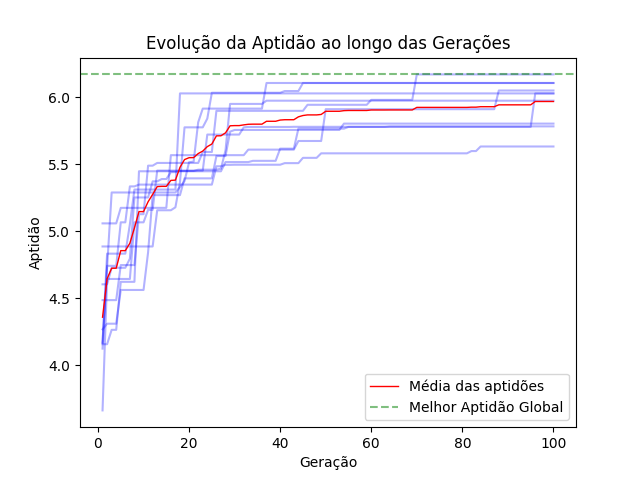

# k8sgaScheduler
**Algoritmo para alocação inteligente de recursos em cluster kubernetes**

Este repositório armazena o protótipo de um algoritmo genético desenvolvido para aprimorar do scheduler padrão do Kubernetes. O objetivo é encontrar a melhor alocação possível de pods, visando maximizar a eficiência do cluster.

Os Algoritmos Genéticos são uma técnica de otimização inspirada na teoria da evolução biológica. São amplamente utilizados para resolver problemas complexos de otimização, incluindo a alocação eficiente de recursos, e podem ser aplicados à solução deste problema.

Para representar o problema por meio do Algoritmo Genético, a lógica de implementação foi formulada da seguinte maneira: Um cromossomo [0,1,0,2] representa a alocação de 4 pods em 3 nós. Eles estão alocados da seguinte forma: o pod 0 está alocado no nó 0, o pod 1 está alocado no nó 1, o pod 2 está alocado no nó 0 e o pod 3 está alocado no nó 2.

Para o ambiente, foram criadas três matrizes:

1. **Matriz de nós:** Representa os nós que receberão as alocações de PODs. Esta matriz possui os campos: ID, CPU e memória para cada nó.
2. **Matriz de PODs:** Representa os PODs a serem alocados. Esta matriz também possui os campos: ID, CPU e memória para cada POD.
3. **Matriz simétrica de relacionamentos:** Representa a taxa de envio e recebimento de informações entre os PODs. Esta representação abstrai que dado um valor na matriz, simboliza o peso da quantidade de troca de informações entre os PODs.

> **Nota**: O projeto em fase de andamento porém funcional para testes iniciais

## Cenários de teste:

Foram formulados 3 cenários de testes para avaliação do modelo:

1. Baixa capacidade - 20 pods
   - 20 pods com cpu de 50 milicores e memória de 64B.
2. Capacidade aleatória - 25 pods
   - 15 pods com cpu de 50 milicores e memória de 64MB.
   - 10 pods com CPU de 100 milicores e memória de 128MB.
3. Alta capacidade - 30 pods
    - 20 pods com CPU de 50 milicores e memória de 64MB.
    - 10 pods com CPU de 100 milicores e memória de 128MB.

## Arquivos do repositório:

Na raiz do repositório estão os três algoritmos que retornam as melhores alocações em três cenários diferentes:

- k8sgascheduler_a.py
  - Arquivo referente ao texte de baixa capacidade
- k8sgascheduler_b.py
  - Arquivo referente ao texte de capacidade aleatória
- k8sgascheduler_c.py
  - Arquivo referente ao texte de alta capacidade

No diretório \calcular encontram-se três arquivos que calculam a apitidão de uma alocação específica inserida pelo usuário.

- Diretório \calcular
  - aptidao_a.py
    - Calcula aptidão para uma alocação do cenário de Baixa capacidade
  - aptidao_b.py
    - Calcula aptidão para uma alocação do cenário de Capacidade aleatória
  - aptidao_c.py
    - Calcula aptidão para uma alocação do cenário de Alta capacidade
  
> **Nota**: Para informar uma alocação específica e receber sua aptidão altere o valor da variável 'alocação'. Exemplo: alocacao = [0,1,1,1,0,2,0,2,2,1,1,2,0,0,1,0,0,2,2,2]

## Como utilizar:

Clone este repositório e execute:

```bash
cd k8sgascheduler
python k8sgascheduler_a.py
```

O fluxo do algoritmo ocorre da seguinte maneira:

1. Serão solicitadas as seguintes informações ao usuário:
   - Quantidade de vezes que o teste será executado (tecle enter para padrão 10):
   - Quantidade de Nós do cluster (tecle enter para padrão 3):
   - Quantidade de PODs do cluster (tecle enter para padrão 20):

2. Serão criadas três matrizes:
   - Matriz dos Nós 
       - Contem informações dos Nós do Cluster
       - É criada automaticamente com os valores predefinidos nas variáveis
       ```python
       matriz_nos = [
           {"id": 0, "cpu_no": 2000, "memoria_no": 2048},
           {"id": 1, "cpu_no": 2000, "memoria_no": 2048},
           {"id": 2, "cpu_no": 2000, "memoria_no": 2048}
       ]
       ```
   - Matriz dos PODs
       - Contem informações sobre os PODs a serem alocados
       - É criada automaticamente com os valores predefinidos nas variáveis
       ```python
       matriz_pods = [
           {"id": 0, "cpu": 50, "memoria": 64},
           {"id": 1, "cpu": 50, "memoria": 64},
           {"id": 2, "cpu": 50, "memoria": 64},
           {"id": 3, "cpu": 50, "memoria": 64},
           {"id": 4, "cpu": 50, "memoria": 64},
           {"id": 5, "cpu": 50, "memoria": 64},
           {"id": 6, "cpu": 50, "memoria": 64},
           {"id": 7, "cpu": 50, "memoria": 64},
           {"id": 8, "cpu": 50, "memoria": 64},
           {"id": 9, "cpu": 50, "memoria": 64},
           {"id": 10, "cpu": 50, "memoria": 64},
           {"id": 11, "cpu": 50, "memoria": 64},
           {"id": 12, "cpu": 50, "memoria": 64},
           {"id": 13, "cpu": 50, "memoria": 64},
           {"id": 14, "cpu": 50, "memoria": 64},
           {"id": 15, "cpu": 50, "memoria": 64},
           {"id": 16, "cpu": 50, "memoria": 64},
           {"id": 17, "cpu": 50, "memoria": 64},
           {"id": 18, "cpu": 50, "memoria": 64},
           {"id": 19, "cpu": 50, "memoria": 64}
       ]
       ```
   - Matriz de Relacionamentos
       - A matriz de relacionamentos é uma matriz simétrica
       - Contem o peso do relacionamento entre os pods
       - Por padrão é preenchida de forma aleatória em uma proporção de 10/% com valores de 0 a 1
       ```python
       matriz_relacionamentos = [
           [0, 0, 0, 0, 0, 0, 0, 0, 0, 0, 0, 0, 0, 0.22, 0, 0, 0.4, 0, 0, 0,],
           [0, 0, 0, 0, 0, 0, 0, 0, 0, 0, 0, 0, 0, 0.77, 0, 0, 0, 0, 0, 0,],
           [0, 0, 0, 0, 0, 0, 0, 0, 0, 0.41, 0, 0.64, 0, 0, 0.13, 0, 0, 0, 0, 0,],
           [0, 0, 0, 0, 0, 0, 0, 0.76, 0.29, 0, 0, 0, 0, 0, 0, 0, 0, 0, 0, 0.06,],
           [0, 0, 0, 0, 0, 0, 0, 0, 0, 0, 0, 0, 0, 0, 0, 0, 0, 0, 0, 0.49,],
           [0, 0, 0, 0, 0, 0, 0, 0, 0, 0, 0, 0, 0, 0, 0, 0, 0, 0, 0, 0,],
           [0, 0, 0, 0, 0, 0, 0, 0, 0.06, 0, 0, 0, 0, 0, 0, 0, 0, 0, 0, 0,],
           [0, 0, 0, 0.76, 0, 0, 0, 0, 0, 0, 0, 0, 0, 0, 0, 0, 0, 0, 0, 0,],
           [0, 0, 0, 0.29, 0, 0, 0.06, 0, 0, 0, 0, 0, 0, 0, 0, 0, 0, 0.07, 0.16, 0,],
           [0, 0, 0.41, 0, 0, 0, 0, 0, 0, 0, 0, 0, 0, 0, 0, 0, 0, 0, 0, 0,],
           [0, 0, 0, 0, 0, 0, 0, 0, 0, 0, 0, 0, 0, 0, 0, 0, 0, 0, 0, 0,],
           [0, 0, 0.64, 0, 0, 0, 0, 0, 0, 0, 0, 0.83, 0, 0, 0, 0, 0, 0, 0, 0,],
           [0, 0, 0, 0, 0, 0, 0, 0, 0, 0, 0, 0, 0, 0, 0, 0, 0, 0.78, 0.43, 0,],
           [0.22, 0.77, 0, 0, 0, 0, 0, 0, 0, 0, 0, 0, 0, 0, 0, 0, 0, 0.26, 0, 0,],
           [0, 0, 0.13, 0, 0, 0, 0, 0, 0, 0, 0, 0, 0, 0, 0, 0, 0, 0, 0, 0,],
           [0, 0, 0, 0, 0, 0, 0, 0, 0, 0, 0, 0, 0, 0, 0, 0, 0, 0, 0, 0,],
           [0.4, 0, 0, 0, 0, 0, 0, 0, 0, 0, 0, 0, 0, 0, 0, 0, 0, 0, 0, 0,],
           [0, 0, 0, 0, 0, 0, 0, 0, 0.07, 0, 0, 0, 0.78, 0.26, 0, 0, 0, 0.25, 0, 0,],
           [0, 0, 0, 0, 0, 0, 0, 0, 0.16, 0, 0, 0, 0.43, 0, 0, 0, 0, 0, 0, 0,],
           [0, 0, 0, 0.06, 0.49, 0, 0, 0, 0, 0, 0, 0, 0, 0, 0, 0, 0, 0, 0, 0]
     ]
       ```
3. O algoritmo irá buscar a melhor alocação possível levando em consideração:
    1. A taxa de comunicação entre os pods
        - É preferível alocar no mesmo nó os pods que possuem maior taxa de comunicação entre si.
    2. O consumo de CPU
        - O algoritmo deve otimizar o consumo de CPU dos nós.
        - Deve respeitar os limites de recursos disponíveis no nó. 
        - Não deve aceitar alocações que excedam os recursos disponíveis no nó, garantindo que sejam factíveis.
    3. O consumo de memória
        - Os mesmos requisitos aplicados para a CPU devem ser aplicados para a memória.

> **Note**: O peso do relacionamentos refere-se  à intensidade da troca de informações entre um POD i e um POD j.

## Resultado do algoritmo

Saída do algoritmo com os valores padrões:

```bash
---------------------------------------------
Melhor alocação encontrada no teste: 9
---------------------------------------------
Alocação: [0, 0, 1, 0, 0, 1, 0, 0, 0, 1, 1, 1, 0, 0, 1, 1, 0, 0, 0, 0]
Aptidão: 6.1045703125
O POD 0 está alocado no Nó '0'
O POD 1 está alocado no Nó '0'
O POD 2 está alocado no Nó '1'
O POD 3 está alocado no Nó '0'
O POD 4 está alocado no Nó '0'
O POD 5 está alocado no Nó '1'
O POD 6 está alocado no Nó '0'
O POD 7 está alocado no Nó '0'
O POD 8 está alocado no Nó '0'
O POD 9 está alocado no Nó '1'
O POD 10 está alocado no Nó '1'
O POD 11 está alocado no Nó '1'
O POD 12 está alocado no Nó '0'
O POD 13 está alocado no Nó '0'
O POD 14 está alocado no Nó '1'
O POD 15 está alocado no Nó '1'
O POD 16 está alocado no Nó '0'
O POD 17 está alocado no Nó '0'
O POD 18 está alocado no Nó '0'
O POD 19 está alocado no Nó '0'
Recursos utilizados Nó 0: Memória = 832 CPU = 650
Recursos utilizados Nó 1: Memória = 448 CPU = 350
Recursos utilizados Nó 2: Memória = 0 CPU = 0
O somatório do peso do relacionamento dos pods do nó 0 é 4.75
O somatório do peso do relacionamento dos pods do nó 1 é 1.1800000000000002
O somatório do peso do relacionamento dos pods do nó 2 é 0
---------------------------------------------
Melhor Alocação Global
Melhor Aptidão Global: 6.168632812499999
Melhor Alocação Global: [0, 0, 0, 0, 0, 2, 0, 0, 0, 0, 2, 0, 0, 0, 0, 2, 0, 0, 0, 0]
```
O algoritmo irá retornar o melhor indivíduo (melhor alocação) de cada uma das gerações. Ao final o Algoritmo retorna a melhor alocação e a melhor aptidão encontrada.

Além disso, o algoritmo irá gerar um gráfico representando a evolução das alocações até a alocação ótima ser encontrada

- Cada traço azul representa uma evolução do algoritmo em cada rodada que foi executada.
- A linha pontilhada em verde demarca a melhor aptidão encontrada.
- A linha em vermelho demarca a média das aptidões.



Observando o gráfico, podemos notar a evolução das aptidões convergindo para o ótimo global. É possível, dado o contexto, que alocações diferentes resultem em um mesmo valor de aptidão, desde que atendam aos critérios propostos.

### Calculando a Aptidão de uma alocação:
Para inserir uma alocação e receber a aptidão da alocação desejada, basta acessar o arquivo calcular\aptidao_a.py e alterar o valor da variável "alocacao", inserindo a alocação desejada. O algoritmo irá retorar a aptidão da alocação.

```bash
python calcular\aptidao_a.py
```

```python
Alocação informada: [0, 1, 1, 1, 0, 2, 0, 2, 2, 1, 1, 2, 0, 0, 1, 0, 0, 2, 2, 2]
Aptidão da alocação: 0.07153645833333333
```

## Alteração de Parâmetros

### 1. Controle do Algoritmo

As características de funcionamento do algoritmo genético, bem como as definições de recursos de memória e CPU tanto dos nós quanto dos pods podem ser alteradas diretamente em suas respectivas variáveis no código do algoritmo.

```python
tam_populacao = 100         # Tamaho da população do GA
num_geracoes = 100          # Numero de gerações do GA
prob_cruzamento = 0.8       # Probabilidade de cruzamento (80%)
prob_mutacao = 0.2          # Probabilidade de mutação (20%)
qt_teste = 10               # Qt de vezes que o teste será executado por padrão
numero_nos = 3              # Qt padrão de nós
cpu_no = 2000               # Qt de CPU de cada Nó
mem_no = 2048               # Qt de Memória de cada Nó
numero_pods = 20            # Qt de PODs a serem alocados
cpu_pod = 50                # Qt de CPU de cada POD
mem_pod = 64                # Qt de Memória de cada POD
```

> **Note**: Ao alterar a quantidade de nós e de pods, é necessário modificar as variáveis numero_nos e numero_pod no código. No entanto, se a quantidade de pods for modificada, é importante ajustar também a matriz de relacionamentos de acordo com a nova quantidade de pods inseridos.

### 2. Alterando a matriz de relacionamentos

Através do arquivo "matrizes\gera_matriz_relacionamentos.py", é possível criar uma nova matriz. Se desejar realizar testes alterando a quantidade de pods ou ajustando a taxa de relacionamentos. Para isso basta:
1. Abrir o arquivo e alterar as variaveis:
   - numero_pods = 25
   - taxa_rel = 30
2. Execute o arquivo para gerar a nova matriz
3. Copie o conteúdo gerado e cole como valor da matriz "matriz_relacionamentos" no arquivo "k8sgascheduler_a.py"

Para este exemplo específico, após ajustar as variáveis no arquivo "gera_matriz_relacionamentos.py", o conteúdo gerado poderia seria semelhante a:

```python
    matriz_relacionamentos = [
        [0, 0, 0, 0, 0, 0, 0.17, 0, 0.67, 0, 0.1, 0, 0.21, 0.7, 0.11, 0, 0, 0.13, 0.54, 0, 0, 0.68,],
        [0, 0.04, 0, 0.72, 0, 0, 0, 0, 0.13, 0.17, 0, 0.4, 0, 0.16, 0, 0, 0.06, 0.66, 0, 0.52, 0.75, 0,],
        [0, 0, 0, 0.57, 0.07, 0, 0.02, 0, 0, 0, 0, 0.13, 0.99, 0.94, 0.42, 0.82, 0, 0.28, 0.73, 0, 0.94, 0,],
        [0, 0.72, 0.57, 0, 0, 0.24, 0.58, 0, 0, 0.9, 0, 0, 0, 0, 0.37, 0.57, 0, 0, 0, 0.65, 0, 0,],
        [0, 0, 0.07, 0, 0, 0.82, 0, 0, 0.82, 0.29, 0, 0, 0, 0, 0.31, 0.71, 0, 0, 0, 0.38, 0.77, 0,],
        [0, 0, 0, 0.24, 0.82, 0, 0, 0.05, 0, 0, 0.08, 0, 0, 0, 0, 0, 0, 0, 0, 0, 0, 0,],
        [0.17, 0, 0.02, 0.58, 0, 0, 0, 0.52, 0, 0, 0.78, 0, 0, 0, 0.64, 0, 0, 0, 0, 0.29, 0, 0.53,],
        [0, 0, 0, 0, 0, 0.05, 0.52, 0, 0, 0.23, 0.37, 0, 0, 0, 0, 0, 0, 0, 0.01, 0, 0, 0,],
        [0.67, 0.13, 0, 0, 0.82, 0, 0, 0, 0.48, 0, 0.2, 0, 0.25, 0, 0.66, 0, 0, 0, 0, 0, 0, 0,],
        [0, 0.17, 0, 0.9, 0.29, 0, 0, 0.23, 0, 0, 0, 0.73, 0, 0, 0.28, 0, 0, 0, 0, 0, 0, 0,],
        [0.1, 0, 0, 0, 0, 0.08, 0.78, 0.37, 0.2, 0, 0, 0.2, 0.33, 0.11, 0.43, 0, 0, 0, 0, 0.91, 0.3, 0.64,],
        [0, 0.4, 0.13, 0, 0, 0, 0, 0, 0, 0.73, 0.2, 0, 0, 0, 0, 0.38, 0, 0, 0, 0, 0, 0.01,],
        [0.21, 0, 0.99, 0, 0, 0, 0, 0, 0.25, 0, 0.33, 0, 0, 0.09, 0, 0, 0, 0, 0, 0, 0.32, 0,],
        [0.7, 0.16, 0.94, 0, 0, 0, 0, 0, 0, 0, 0.11, 0, 0.09, 0, 0.56, 0, 0, 0.26, 0.18, 0, 0, 0.26,],
        [0.11, 0, 0.42, 0.37, 0.31, 0, 0.64, 0, 0.66, 0.28, 0.43, 0, 0, 0.56, 0.02, 0.73, 0, 0, 0, 0, 0, 0.46,],
        [0, 0, 0.82, 0.57, 0.71, 0, 0, 0, 0, 0, 0, 0.38, 0, 0, 0.73, 0, 0.38, 0, 0, 0, 0, 0,],
        [0, 0.06, 0, 0, 0, 0, 0, 0, 0, 0, 0, 0, 0, 0, 0, 0.38, 0, 0.28, 0, 0, 0, 0.99,],
        [0.13, 0.66, 0.28, 0, 0, 0, 0, 0, 0, 0, 0, 0, 0, 0.26, 0, 0, 0.28, 0, 0, 0.58, 0.06, 0,],
        [0.54, 0, 0.73, 0, 0, 0, 0, 0.01, 0, 0, 0, 0, 0, 0.18, 0, 0, 0, 0, 0, 0, 0, 0,],
        [0, 0.52, 0, 0.65, 0.38, 0, 0.29, 0, 0, 0, 0.91, 0, 0, 0, 0, 0, 0, 0.58, 0, 0, 0, 0.88,],
        [0, 0.75, 0.94, 0, 0.77, 0, 0, 0, 0, 0, 0.3, 0, 0.32, 0, 0, 0, 0, 0.06, 0, 0, 0.29, 0.91,],
        [0.68, 0, 0, 0, 0, 0, 0.53, 0, 0, 0, 0.64, 0.01, 0, 0.26, 0.46, 0, 0.99, 0, 0, 0.88, 0.91, 0]
    ]
````

> **Nota**: 
> 1. Ao alterar a quantidade de pods (variavel numero_pods) uma nova matriz com a quantidade de pods correspondente deve ser gerada.
> 2. A matriz de relacionamentos é preenchia de forma aleatória.

## Observações 

- Para os Testes k8sgascheduler_b e k8sgascheduler_c, o algoritmo requer apenas a especificação da quantidade de vezes que será executado. Para alterar os valores e quantidades dos pods e nós, essas informações devem ser inseridas nas variáveis e matrizes do algoritmo.

- No diretório "matrizes" estão registradas as matrizes de relacionamento geradas para cada um dos testes

## Resultados dos testes B e C


- Evolução das aptidões do teste B


- Evolução das aptidões do teste C