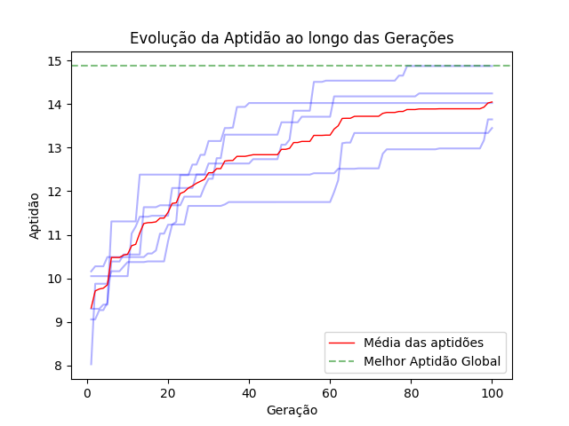

# Documentação

> Bem vindo à documentação do **K8sGaScheduler**. Este repositório contém a documentação e o registro dos testes do artefato proposto no artigo: *K8sGAScheduler: Algoritmo para alocacaçao inteligente de recursos em cluster kubernetes*.

O problema foi representado por meio de uma modelagem matemática e implementado com Algoritmo Genético, uma técnica de otimização inspirada na teoria da evolução biológica. A lógica de implementação foi formulada da seguinte maneira: um cromossomo [0,1,0,2] representa a alocação de quatro pods em três nós, onde o pod 0 está alocado no nó 0, o pod 1 no nó 1, o pod 2 no nó 0 e o pod 3 no nó 2. Avalia-se a qualidade de cada alocação de forma a encontrar a alocação mais eficiente.


## Fluxo de funcionamento do Algoritmo

### 1. Inicia três matrizes:

  - Matriz de nós:
    - Essa matriz representa os nós do cluster
    - Possui os campos: id, cpu_no, mem_no
  - Matriz de pods:
    - Essa matriz representa os pods a serem alocados
    - Possui os campos: id, cpu_pod, mem_pod
  - Matriz simétrica de relacionamentos
    - Essa matriz representa a taxa de relacionamento entre os pods

### 2. Implementa o fluxo do algoritmo genético

1. Inicialização da População -> População com 100 individuos onde cada cromossomo carrega uma possível solução
2. Avaliação da Aptidão (Fitness) -> Calcula o quão boa é a alocação com base no modelo matemático
3. Seleção dos Pais -> Seleciona os cromossomos pais utilizando o método da roleta
4. Cruzamento -> Realiza o cruzamento entre os pais selecionados para gerar novos cromossomos (filhos)
5. Mutação -> Aplica a mutação (troca aleatória de gene) para permitir a busca de novas soluções
6. Avaliação da Aptidão dos filhos -> Calcula a aptidão de solução de cada filho gerado
7. Seleção dos Sobreviventes -> Exclui parte da população gerada e seleciona os cromossomos sobreviventes para gerar uma nova população
8. Repetição dos passos 4 a 7 -> Cada iteração do algoritmo corresponde a uma nova geração criada. O algoritmo está configurado para 100 gerações.
9. Retorna com a Melhor Solução Encontrada -> O algoritmo retorna a melhor alocação de PODs em Nós encontrada durante as gerações

### 3. Reexecução

- O algoritmo implementa o fluxo descrito na sessão 2 por 5 vezes (por padrão)
- A quantidade de testes pode ser alterada via linha de comando no início da execução do algoritmo.

### 4. Resultado

- Ao final das execuções será retornado:
  - A Melhor aptidão global
  - A melhor alocação
  - Média
  - Mediana
  - Mínimo e desvio padrão 
  - Gráfico expressando a evolução das aptidões.

Exemplo de saída do algoritmo:

```bash
---------------------------------------------
Melhor alocação encontrada no teste: 4
---------------------------------------------
Alocação: [1, 1, 0, 0, 0, 0, 1, 0, 0, 1, 0, 0, 1, 0, 0, 0, 0, 0, 0, 0, 1, 0, 0, 0, 0]
Aptidão: 14.317050781249998
O POD 0 está alocado no Nó '1'
O POD 1 está alocado no Nó '1'
O POD 2 está alocado no Nó '0'
O POD 3 está alocado no Nó '0'
O POD 4 está alocado no Nó '0'
O POD 5 está alocado no Nó '0'
O POD 6 está alocado no Nó '1'
O POD 7 está alocado no Nó '0'
O POD 8 está alocado no Nó '0'
O POD 9 está alocado no Nó '1'
O POD 10 está alocado no Nó '0'
O POD 11 está alocado no Nó '0'
O POD 12 está alocado no Nó '1'
O POD 13 está alocado no Nó '0'
O POD 14 está alocado no Nó '0'
O POD 15 está alocado no Nó '0'
O POD 16 está alocado no Nó '0'
O POD 17 está alocado no Nó '0'
O POD 18 está alocado no Nó '0'
O POD 19 está alocado no Nó '0'
O POD 20 está alocado no Nó '1'
O POD 21 está alocado no Nó '0'
O POD 22 está alocado no Nó '0'
O POD 23 está alocado no Nó '0'
O POD 24 está alocado no Nó '0'
Recursos utilizados Nó 0: Memória = 1792 CPU = 1400
Recursos utilizados Nó 1: Memória = 448 CPU = 350
Recursos utilizados Nó 2: Memória = 0 CPU = 0
O somatório do peso do relacionamento dos pods do nó 0 é 13.079999999999998
O somatório do peso do relacionamento dos pods do nó 1 é 0.57
O somatório do peso do relacionamento dos pods do nó 2 é 0
---------------------------------------------
Melhor Alocação Global
Melhor Aptidão Global: 14.317050781249998
Melhor Alocação Global: [1, 1, 0, 0, 0, 0, 1, 0, 0, 1, 0, 0, 1, 0, 0, 0, 0, 0, 0, 0, 1, 0, 0, 0, 0]
Média Global das Aptidões: 12.149428984375001
Mediana Global das Aptidões: 12.35016927083333
Mínimo Global das Aptidões: 8.6046484375
Desvio Padrão Global das Aptidões: 1.3930955243320127
Melhor Aptidão Global: 14.317050781249998
```



- Cada traço azul representa uma evolução do algoritmo em cada rodada que foi executada.
- A linha pontilhada em verde demarca a melhor aptidão encontrada.
- A linha em vermelho demarca a média das aptidões.

Observando o gráfico, podemos notar a evolução das aptidões convergindo para o ótimo global. É possível, dado o contexto, que alocações diferentes resultem em um mesmo valor de aptidão, desde que atendam aos critérios propostos.

## Cenários de teste:

Para simular diferentes capacidades de alocação, foram projetados três cenários diferentes intitulados: Baixa demanda, Média demanda e Alta demanda, com alocação de 20, 25 e 30 pods, respectivamente.

1. Baixa Demanda - 20 pods
   - 20 pods com cpu de 50 milicores e memória de 64Mb.
2. Média Demanda - 25 pods
   - 15 pods com cpu de 50 milicores e memória de 64Mb.
   - 10 pods com CPU de 100 milicores e memória de 128Mb.
3. Alta Demanda - 30 pods
    - 20 pods com CPU de 50 milicores e memória de 64Mb.
    - 10 pods com CPU de 100 milicores e memória de 128Mb.

Para avaliar os resultados do K8sGASchedule foram executadas dois conjuntos de avaliação sendo: no primeiro ciclo de avaliação foi definido uma taxa de relacionamento de 0% para matriz de relacionamentos, representando a ausência de comunicação entre os pods para tomada de decisão de alocação. Esse conjunto de testes está armazenado no diretório docs/ga/taxa_rel_0.

No segundo ciclo, essa taxa foi aumentada para 10%, refletindo o preenchimento de 10% dos valores na matriz simétrica, representando o custo de comunicação entre os pods para a alocação. Esse conjunto de testes está armazenado no diretório docs/ga/taxa_rel_10.

Cada um dos algoritmos de cada um dos ciclos de avaliação foram executados 50 (cinquenta) vezes. Para cada ciclo de avaliação foi registrado: a melhor aptidão, a média global das aptidões, a mediana e o desvio padrão.

## Alteração de Parâmetros

### 1. Controle do Algoritmo

As características de funcionamento do algoritmo genético, bem como as definições de recursos de memória e CPU tanto dos nós quanto dos pods podem ser alteradas diretamente em suas respectivas variáveis no código do algoritmo.

```python
tam_populacao = 100         # Tamaho da população do GA
num_geracoes = 100          # Numero de gerações do GA
prob_cruzamento = 0.8       # Probabilidade de cruzamento (80%)
prob_mutacao = 0.2          # Probabilidade de mutação (20%)
qt_teste = 10               # Qt de vezes que o teste será executado por padrão
```

### 2. Nós e Pods

Para alterar a quantidade de Nós ou de Pods, é necessário:
1. modificar as variáveis numero_nos ou numero_pod com a quantidade de Nós ou Pods
2. Ajustar as respectivas matrizes de Nós ou Pods (matriz_nos ou matriz_pods) com as quantaides de nós e pods e suas demandas por recursos.
3. Ajustar a matriz de relacionamentos (matriz_relacionamentos) de acordo com a nova quantidade de pods inseridos.

### 3. Matriz de relacionamentos

Através do arquivo "docs/ga/gera_matriz_relacionamentos.py", é possível criar uma nova matriz. Se desejar realizar testes alterando a quantidade de pods ou ajustando a taxa de relacionamentos. Para isso basta:
1. Abrir o arquivo e alterar as variaveis:
   - numero_pods = 25
   - taxa_rel = 30 (nesse exemplo será gerada uma matriz simétrica com 30% de preenchimento com valores entre 0 e 1)
2. Execute o arquivo para gerar a nova matriz
3. Copie a matriz gerada e insira como conteúdo no algoritmo

### Calculando a Aptidão de uma alocação:

Você pode, com base em um vetor de alocação, calcular qual a aptidão daquela distribuição de Pods. Para inserir uma alocação e receber a aptidão da alocação inserida, basta acessar o arquivo "docs/ga/calcular_aptidao.py". Nesse arquivo você deverá configurar:
1. Os parâmetros desejados do G.A.
2. Preencher as variáveis do cluster
3. Inserir o vetor de alocação na variável "alocacao"
4. Configurar os valores das matrizes: matriz_nos, matriz_pods e matriz_relacionamentos conforme os parâmetros do ambiente desejado.

Com base nas informações o altoritmo irá calcular a aptidão da alocação. Exemplo:

```python
Alocação informada: [0, 1, 1, 1, 0, 2, 0, 2, 2, 1, 1, 2, 0, 0, 1, 0, 0, 2, 2, 2]
Aptidão da alocação: 0.07153645833333333
```